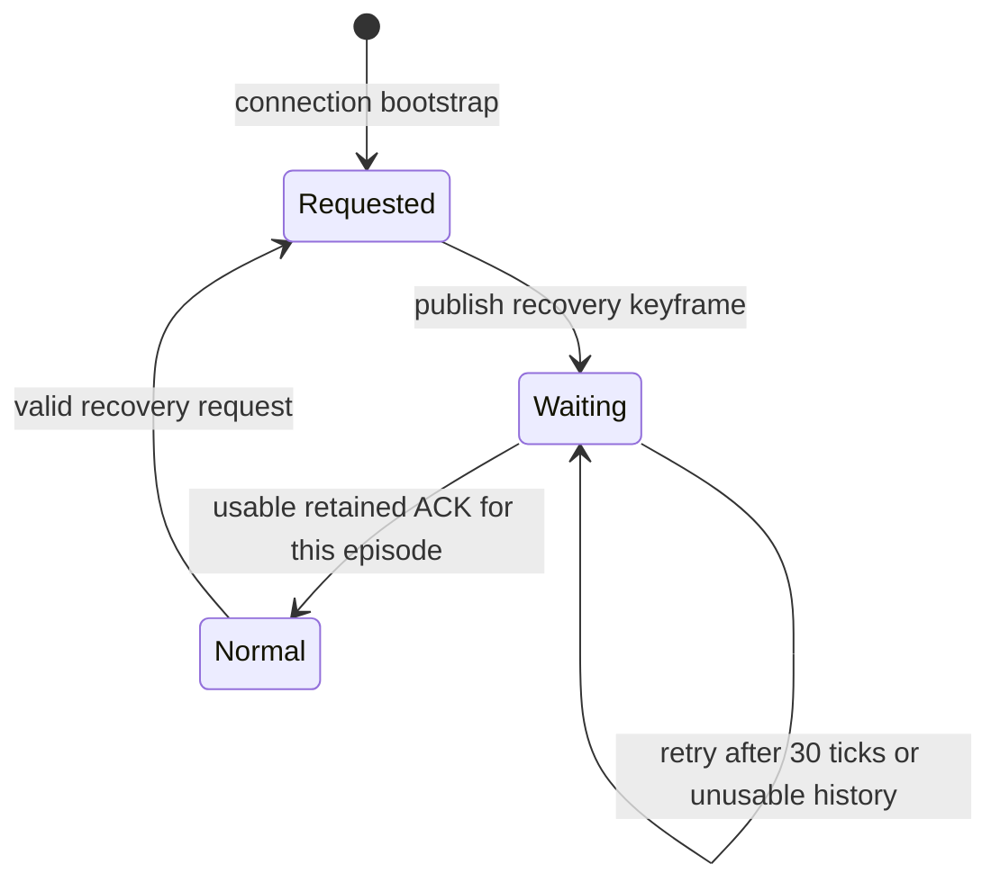

# M3.7.1 — Networking hardening

Measured on 2026-10-04, Linux x86-64, Intel Core Ultra 7 255H, GCC 16.2.1,
C++23. Comparison source is M3.7 commit `87ba842`. Raw CSV, JUnit, build logs,
comparison binaries and sanitizer diagnostics remain local in ignored
`output/m3_7_1/`. No generated assets, restricted reference data or audit ZIPs
are included in this milestone.

## Fixes

- Check ACK progression before looking up retained history; old expired ACKs
  cannot rewind the baseline or initiate recovery.
- Replace a repeatedly re-armed recovery boolean with Requested/Waiting/Normal
  states, a usable-ACK gate, a short retry interval and a deferred-request bit.
- Include one signed quantized steering byte in remote controls field group 4.
- Sample remote motion, visual controls, engine/nozzle state and discrete metadata
  at one effective presentation tick after adaptive tier buffering.
- Centralize the 1,100-byte application budget; enforce it in live encode/decode
  and transport, check record/batch capacity at compile time, and reject chunk
  count overflow before allocating another chunk.
- Add recovery telemetry, baseline/assembly ownership measurements, permanent
  16/64-player loss workloads and ACK/recovery/property/budget regressions.

Protocol **10** is a schema revision of v9: the remote controls group changes
from five to six bytes. It preserves the existing architecture, message types,
owner representation, chunk layout, quantization and authority. Version mismatch
is rejected explicitly; rebuild clients and servers together.

No physics, aircraft, prediction, AOI radii/rates, gun rules, or M4 gameplay was
added or redesigned.

## ACK behavior

Previously, a missing history entry was checked before monotonic progression.
A delayed ACK for an expired old frame could set recovery even when a newer
usable ACK had already been accepted. Recovery flags independently set the old
boolean on every input packet.

Now:

| ACK | Action |
|---|---|
| Older nonzero ACK | Ignore, including its reordered recovery flag; no history lookup |
| Duplicate ACK | Ignore progression; an explicit recovery request is separately bounded |
| Newer retained ACK | Advance accepted baseline; complete a pending recovery episode when usable |
| Newer expired ACK | Count baseline miss, retain accepted ACK, request bounded recovery |
| Future/invalid ACK | Reject; cannot alter recovery or baseline |
| Zero | No-baseline sentinel; never rewinds the accepted ACK; explicit recovery remains available |

Snapshot IDs are strictly increasing **uint64**, with zero reserved. They cannot
wrap: `nextSnapshotSequence` returns an explicit `overflow_error` at exhaustion.
The wire parser requires nonzero sequence and `baseline < sequence`. This keeps
plain ordering correct rather than applying wrap arithmetic inconsistently across
ACKs, chunks, assemblies and history. Tests cover the last valid increment and
rejection of wrap to zero. The presentation timeline also retains its existing
`(1<<53)-1024` tick limit; a live session cannot reach sequence exhaustion within
that timeline.

## Recovery state machine

A recovery publication records both the episode's first sequence and the latest
retry sequence. A usable retained ACK at or after the first sequence completes
recovery, including an earlier retry's ACK arriving late. Subsequent frames use
the accepted baseline. Before the first usable ACK, they may depend on the sent
recovery keyframe; loss of that bootstrap frame produces clean baseline misses
until a retry succeeds. This avoids repeatedly sending full frames before the
first ACK.

Retry interval and new-episode cooldown are **30 server ticks / 250 ms**. Repeated
requests while Waiting coalesce. A single request during Normal's cooldown is
remembered and serviced at the next eligible publication; it is not lost. The
retry interval adds at most the short cooldown plus publication/delivery delay,
not a several-second stall. Periodic 240-tick refresh, lifecycle/AOI entry and
reference changes retain their independent existing reasons for keyframes.

Counters distinguish requests received, coalesced/deferred requests, recovery
keyframes, retries, completed episodes, stale ACKs and rejected ACKs. Initial
bootstrap counts as recovery. Ordinary lifecycle/reference/periodic keyframes
are counted in total keyframes but not as recovery keyframes.

The 100-publication storm tests bound recovery keyframes to 17 during 500 server
ticks, both with healthy ACKs and with all packets dropped. Healthy/5% loss runs
complete 17 episodes. The total-loss case sends one additional retry after
restoring delivery and then completes. Old code could re-arm a full frame on every
publication. The malformed/reordered baseline fuzz adds 4,000 publications; the
existing parser fuzz still exercises 50,000 random/mutated packets.

## Remote presentation synchronization

`RemoteTrack::sampleAircraft` resolves buffering once, subtracts the adaptive
extra delay, and uses that effective tick to choose the physical sample and all
its visual metadata. `sample` delegates to that same path. Gear, flap, spoiler,
throttle and steering interpolate between the same two samples as motion, spool,
afterburner, inlet and nozzle angle. Discrete life/type/flags/loading use the
preceding sample and switch at the endpoint. Samples before history clamp to the
first complete aircraft, not the latest metadata. Extrapolated motion retains
latest controls and the existing 50 ms bound.

Near/medium/far delays remain 12/24/60 ticks, with fast buffering growth and gentle
release on promotion. Regression fixtures vary gear/flaps/steering/reheat/nozzle
angle, throttle, airbrake, discrete flags and loading through tier transitions and
check their association with the physical presentation sample.

## Steering

Remote field group 4 contains the original five unit bytes followed by **signed8
steering**. Range is **−1…+1**, resolution **1/127 ≈ 0.007874**, worst rounding error
**1/254 ≈ 0.003937** of normalized travel. Code −128 is reserved/rejected. Left,
center and right are exact; zero and the default remain straight. Steering shares
the controls change mask, so unchanged quantized steering adds no delta field.
There are endpoint, 20,000 random round-trip, reserved-code and changed/unchanged
delta tests. Remote payload is now **107 bytes** relative / **122 bytes** absolute;
full owner state remains 562 bytes.

## Packet budgets

Application messages/chunks remain at most **1,100 bytes**, GNS configured UDP MTU
**1,200 bytes**, maximum chunks **16**, incomplete assemblies **4**, retained
baselines **64**, interpolation samples **32**, input commands **8**, combat events
**10**. No IP-fragmentation assumption or payload increase was introduced.

Compile-time checks cover maximum field storage plus record/header lengths,
full-owner record fit, inline field-length capacity, chunk-count encoding, total
chunk budget and current combat
batch wire size. Field storage capacity is derived from the declared field
capacities. `packetize` rejects a missing/mismatched baseline and throws an explicit
`length_error` for record/chunk budget overflow; the 17th chunk is rejected before
allocation. Live `encode` returns an explicit exception on oversized messages,
`decode` rejects oversize, and transport returns failure without sending oversize
or empty payloads. These checks also execute in Release. The legacy full-world
Snapshot serializer remains a bounded offline comparison format; live clients
prohibit it and transport enforces the same application cap.

Budget tests cover exactly 1,100 bytes, 1,101 safely split/rejected as appropriate,
16 encoded and atomically received valid chunks, rejection of 17, oversized declared counts/field lengths,
truncation, and an oversized future combat batch. Existing packet tests also cover
conflicting copies, malformed headers and every truncation of a valid first chunk.

## Loss testing

Permanent CTest modes are `replication.loss16` and `replication.loss64`. Both run
10 simulated seconds of clustered mixed A320/Typhoon/SR-71/Su-57 production physics,
prediction/replay, wire parsers, lifecycle, sender/receiver and interpolation.
Seed 370 supplies independent **5% application packet loss** and 9–13 ticks
one-way lag/jitter (75–108.3 ms); varying due times reorder packets. Reliable
messages preserve ordering. Frames apply only when all chunks are assembled.
Counts include bootstrap and the last in-flight frames; bandwidth excludes the
first second. This deliberately matches the audit workload, not a drained link.

| Clients | Version | Generated | Applied | Usable | Out MB/s | Keyframes | Deltas | Decode failures |
|---|---|---:|---:|---:|---:|---:|---:|---:|
| 16 | M3.7 | 3,840 | 3,431 | 89.349% | 0.660826 | 348 | 3,492 | 0 |
| 16 | M3.7.1 | 3,840 | 3,366 | 87.656% | 0.661635 | 268 | 3,572 | 0 |
| 64 | M3.7 | 15,360 | 11,100 | 72.266% | 8.941005 | 1,493 | 13,867 | 0 |
| 64 | M3.7.1 | 15,360 | 11,041 | 71.882% | 8.962036 | 1,199 | 14,161 | 0 |

| Clients | Requests | Coalesced/deferred | Recovery keys | Retries | Completed | Receiver baseline misses | Sender baseline misses | Expired/evicted assemblies |
|---|---:|---:|---:|---:|---:|---:|---:|---:|
| 16 | 309 | 309 | 33 | 11 | 22 | 57 | 0 | 2 |
| 64 | 1,381 | 1,381 | 137 | 56 | 81 | 227 | 0 | 144 |

Coalesced includes a request deferred during cooldown; its eventual keyframe is
counted separately. These counters therefore do not partition requests into sent
versus never-serviced requests. Receiver misses increase because missing bootstrap
keyframes now leave dependent deltas until the short retry, instead of redundant
full frames every publication. Total keyframes fall by 23.0%/19.7%. Usability falls
by 1.693/0.384 percentage points; traffic changes by +0.12%/+0.24%. This tradeoff
bounds client-induced amplification while preserving prompt recovery.

The **16-player acceptance gate** requires usable frames ≥85% and outbound traffic
≤0.80 MB/s, with zero decode failures, fresh final ACKs, finite prediction and
bounded ownership. These margins catch substantial regression relative to the
audited ~89.3%/~0.66 MB/s without hardcoding exact observations. The **64-player
case is a scaling stress test**, with correctness/progress/bounds assertions and
metrics rather than a shipping loss-percentage gate.

**64-player WAN combat is not yet a validated shipping target.**

## Bandwidth

Matched 10-second no-loss comparisons:

| Clustered clients | M3.7 out MB/s | M3.7.1 out MB/s | Usable frames |
|---|---:|---:|---:|
| 16 | 0.595920 | 0.596063 | 100% both |
| 64 | 7.764118 | 7.766571 | 100% both |

These differ slightly from M3.7's 30-second report (0.592278/7.736498 MB/s) because
of the sampling window. The steering byte does not materially change bandwidth.
Input packets remain 72/98/150/254 bytes at depths 1/2/4/8; the old 36,034-byte
64-aircraft offline snapshot remains unsuitable for live transport.

## CPU

Actual GNS uses separate server/peer processes, clustered A320s, 960 server
ticks per eight-second run and an idle host after the full suites. Two matched
trials reverse before/after order. Complete server tick includes poll/dispatch,
physics, replication and transport. Times below are milliseconds; publication
cost includes interest/projection/delta encoding and transport for one peer phase.

| Clients | Version / trial | Full mean | p95 | p99 | Max | Physics mean | Publication mean | Pending transport peak B |
|---|---|---:|---:|---:|---:|---:|---:|---:|
| 16 | M3.7 / 1 | 0.688 | 1.403 | 2.041 | 12.579 | 0.418 | 0.194 | 2610 |
| 16 | M3.7 / 2 | 1.142 | 1.751 | 2.011 | 13.745 | 0.655 | 0.337 | 1774 |
| 16 | M3.7.1 / 1 | 0.804 | 1.317 | 1.792 | 3.376 | 0.491 | 0.234 | 2610 |
| 16 | M3.7.1 / 2 | 1.110 | 1.585 | 2.225 | 11.793 | 0.640 | 0.336 | 1774 |
| 64 | M3.7 / 1 | 4.388 | 5.757 | 7.610 | 15.852 | 1.811 | 2.408 | 307414 |
| 64 | M3.7 / 2 | 4.023 | 5.785 | 6.664 | 51.331 | 1.640 | 2.194 | 1814711 |
| 64 | M3.7.1 / 1 | 4.286 | 5.904 | 6.529 | 19.077 | 1.744 | 2.378 | 671341 |
| 64 | M3.7.1 / 2 | 4.329 | 5.798 | 8.018 | 23.709 | 1.758 | 2.408 | 366000 |

Across matched trials, mean complete cost is **0.915 → 0.957 ms at 16**
and **4.206 → 4.308 ms at 64** (+4.6%/+2.4%). These samples show no material
CPU regression at the shipping target, with substantial 16-player headroom.
All real runs replicated the complete world, had zero send failures and
cleaned up all entities. Pending-byte peaks are aggregate transport-owned
queues, bounded per connection rather than by the baseline memory accounting.

M3.7 historical real 64-player mean/p99/max was **4.022/7.671/18.427 ms**.
Matched current before/after p99 ranges are **6.664–7.610 / 6.529–8.018 ms**.
The initial exploratory after run had a **10.706 ms p99**, mean **4.187 ms**,
max **19.366 ms**; it is retained rather than hidden by the matched reruns.
The **8.333 ms / 120 Hz** target is not a worst-case guarantee: both versions
have larger OS/transport spikes, and 64-player WAN combat remains unvalidated.

Representative mixed-aircraft no-loss complete server means changed
**0.199 → 0.192 ms at 16**, **1.509 → 1.426 ms at 64** in the original matched
10-second comparisons. Loss64 changed **1.672 → 1.682 ms**, p99
**2.368 → 2.050 ms**. An initial loss16 CPU sample rose 0.195 → 0.226 ms,
so three isolated, alternating-order repeats were run to examine that concern.

| 16-player 5% loss repeats | Complete server mean µs (three trials) | Physics mean µs (three trials) |
|---|---|---|
| M3.7 | 203.253 / 217.498 / 204.278 | 164.185 / 169.662 / 161.610 |
| M3.7.1 | 207.007 / 218.365 / 216.358 | 164.499 / 174.134 / 169.385 |

Averaged over those repeats, complete cost is **208.343 → 213.910 µs**
(+2.7%), with unchanged authoritative physics code and varying physics wall
time. Publication/query/projection/delta timings remain separately available
in the deterministic CSV. The initial sample increase was not reproduced as
a substantial consistent networking cost regression.

## Memory

These are peak aggregate **owned replication estimates**, including frame/vector
capacities and estimated map bookkeeping, not allocator/RSS totals or GNS memory.
Interpolation counts occupied `RemoteSample` objects. Fragment memory includes
assembly objects, chunk buffers and estimated bookkeeping. Numbers below are
clustered loss workload measurements, decimal MB.

| Clients | Sender MB | Receiver MB | Interpolation MB | Combined MB | Sender history MB | Receiver history MB | Fragment assemblies MB |
|---|---:|---:|---:|---:|---:|---:|---:|
| 16 | 10.473 | 10.424 | 4.977 | 25.874 | 10.207 | 10.207 | 0.028 |
| 64 | 165.705 | 165.258 | 83.608 | 414.570 | 161.939 | 161.939 | 0.632 |

The 64-player sender stays approximately **166 MB**, combined approximately
**414 MB**. This representation was intentionally retained as a future scalability
target. Every simulated tick checks sender/receiver history ≤64, assemblies ≤4,
interpolation ≤32, pending prediction ≤512 and delivery queue ≤8,192. Aggregate
owned sender/receiver memory also has a ceiling derived from configured history,
entity capacity and bounded metadata overhead. Baseline fuzz asserts ownership
bounds after every publication; disconnect tests clear players/projectiles/queues.

Simulated reliable queues peak at **150,016 B / 2,400,256 B** for 16/64 clients,
including all clients' startup lifecycle. GNS retransmission queues are separately
transport-owned: configured 256 KiB/connection, snapshot backpressure at 128 KiB,
failed reliable delivery closes the connection. Actual GNS pending-byte peaks are
reported with CPU measurements. Queue ownership must not be counted as baseline
memory or claimed to be zero under loss.

## Combat packet sizes

| Current message/event | Maximum encoded application bytes | Delivery |
|---|---:|---|
| Fire intent | 54 | Unreliable, repeated client input; authoritative server admission |
| Shot/fire event | 127 | Reliable, event-driven server batch |
| Hit event | 127 | Reliable, event-driven server batch |
| Destruction event | 127 | Reliable, event-driven server batch |
| Respawn event | 127 | Reliable, event-driven server batch |
| Largest current batch, 10 events | 1,045 | Reliable, within the 1,100-byte cap |

Each event is 102 bytes plus the 24-byte common header and one count byte.
Life/health/ammo/generation/scores/ready/respawn ticks also replicate via snapshots;
reliable Spawn/Despawn messages govern entity existence/generation transitions.
Projectiles/hits remain server-authoritative, and particles are derived locally.
M4 needs explicit prioritization and bounded batch partitioning before adding state.

## Tests

Final full-profile counts from JUnit (each case counted once per profile):

| Profile | Passed | Failed | Skipped/not-run registered tests |
|---|---:|---:|---:|
| Release native, including graphics | 173 | 0 | 0 |
| Debug native, including graphics | 173 | 0 | 0 |
| Headless Debug | 169 | 0 | 0 |
| Debug ASan/UBSan/LSan headless, including local NASA F-16 fixture | 170 | 0 | 0 |

There are **685 passing full-profile invocations**, zero failed and zero
skipped/disabled registered tests. After final formatting and an additional
maximum-valid-16-chunk receiver fixture, all four builds succeeded and all
**14 affected replication cases passed again in each profile** (56 supplemental
passes, excluded from the 685). The receiver fixture repartitions genuine
64-aircraft records into 16 bounded chunks, preserves exactly one owner, and
verifies atomic assembly, rather than only checking an encoder count.

Coverage retains physics, input validation, AOI/hysteresis/tiers, owner
prediction/reconciliation/replay, mixed aircraft, quantization, packetization,
combat firing/ammo/hits/damage/destruction/respawn, lifecycle, real GNS loss
and 180-second deterministic/network/combat soaks. Windows/MSVC runtime and
TSan are unexecuted coverage, separately identified below, not registered
CTest passes or skips.

New permanent cases: acknowledgements, recovery_storm, steering,
presentation_sync, budgets, combat_sizes, baseline_fuzz, clustered16, loss16,
and loss64. Existing recovery tests now assert that expired stale ACKs are ignored.

The 20,000-state quantization run preserves the original observed maxima exactly:
position **0.008517725 m**, quaternion **0.000058331 rad**, linear velocity
**0.052579597 m/s**, body rate **0.000407218 rad/s**. Authoritative simulation and
owner replay retain full precision; quantization is still only a network boundary.
AOI remains 24/10/2 Hz with hysteresis, owner handling, reliable lifecycle and
bounded extrapolation.

## Sanitizers

**ASan, UBSan and LeakSanitizer: 170/170 full-profile tests passed, zero findings.**
The full invocation took **1,200.73 seconds**. The sanitizer loss64 stress passed
in **153.796 s**; 180-second deterministic/network/combat soaks passed in
**235.726 / 180.175 / 180.995 s** respectively. The final 14-case supplemental
replication check also passed with zero findings. The profile uses
`detect_leaks=1:halt_on_error=1:quarantine_size_mb=4` and
`UBSAN_OPTIONS=halt_on_error=1:print_stacktrace=1`, with the locally available
ASan/UBSan shared runtimes.

ThreadSanitizer compiler/link probe **failed**: `/usr/lib64/libtsan.so.2.0.0` is
unavailable. **Zero TSan tests executed**; this is unavailable coverage, not a pass.
Windows runtime/MSVC was **not run locally**. Existing Windows CI is retained;
serialization uses explicit big-endian scalars, with no host struct packing,
platform byte order or compiler-layout dependency added.

## Remaining scalability limitations

- Multi-chunk all-or-nothing frames amplify independent loss at 64 clustered peers;
  independently applicable chunks remain future work.
- Large baseline-history ownership remains approximately 166 MB sender / 414 MB
  combined at 64 peers; representation/storage redesign is deferred.
- No lag compensation; gun authority remains current server simulation.
- 64-player WAN combat and deployment are not validated shipping targets.
- Future M4 state needs explicit bandwidth prioritization, packet budgets and
  bounded event partitioning; radar/missiles are not implemented here.
- Earth-scale reference frames remain later work.
- 120 Hz's 8.333 ms tick budget does not imply a worst-case 64-player real-time
  guarantee. Windows runtime and TSan remain unverified locally.

## M4 readiness

**M4 may begin for the current 16-player target.** All closure fixes and permanent
regressions are implemented; full native/headless/sanitizer suites pass, genuine
baseline loss recovers, repeated requests are bounded, presentation is coherent,
packet budgets remain enforced, and measured bandwidth/CPU changes are small.
The modest usable-frame tradeoff from bootstrap recovery is explicit and passes
the 16-player loss gate. This readiness does not validate 64-player WAN combat,
Windows runtime, TSan or Earth-scale deployment. Those remain recorded limits.
Radar, missiles and other M4 features were not started in M3.7.1.
