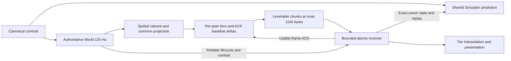

# M3.7 — Multiplayer replication and networking validation

Measured on 2026-10-04 on Linux x86-64, Intel Core Ultra 7 255H, GCC 16.2.1,
C++23. Historical comparison: M3.68.1 commit `ebbd430`. This milestone changes
the replication boundary and test/measurement tools. Authoritative flight physics,
aircraft definitions, rendering resources and gun rules remain the shared existing
implementations. Raw logs, CSV, JUnit and resource measurements are local under
ignored `output/m3_7/`; generated models, reference data and caches are not shipped.

## Architecture

The server runs the existing `World`/`Simulator` at 120 Hz. `InterestGrid` rebuilds
a bounded 3D spatial index and projects common remote fields once for each
publication group. Each connection owns a `ReplicationSender`, reliable existence
metadata, tier scheduler, usable ACK and bounded baseline history. The receiver
assembles chunks atomically, accepts existence only from reliable lifecycle, and
ACKs only complete usable frames. Prediction uses the same `Simulator` and aircraft
configuration as authority; remote quantized states are presentation data.

Each client still receives 24 publications/second. Stable peer phases spread that
work across five physics ticks, avoiding a single all-client burst. GNS batch sends
schedule one connection once per bounded chunk batch; GNS owns message buffers,
including failures. No application threads or asynchronous simulation jobs were
added. The existing GNS service thread remains transport-owned. Measurements below
include dispatch and synchronization; physics-only timing is identified separately.

## Protocol

Protocol **9** replaces v8 live full-world snapshots. The common 24-byte header and
big-endian explicit scalar serialization remain; raw C++ object layout is never
used. New messages are Spawn, Despawn, SnapshotChunk and SnapshotAck. Lifecycle,
destruction, respawn, immutable type metadata and relevant gun events use ordered
reliable delivery. Input, fire intent, ACKs and snapshot chunks remain unreliable.
Old peers receive an explicit version-mismatch rejection and disconnect reason.

The legacy 562-byte full aircraft serializer remains for owner integration/replay,
Welcome/Spawn and historical offline regression tools. The full-world Snapshot
message is prohibited on live clients. See [NETWORK_PROTOCOL.md](NETWORK_PROTOCOL.md)
for every message, field group, enum and validation rule.

## Network state and field audit

| Category | Classification and representation |
|---|---|
| Pose/linear and angular motion | Required frequent remote state, quantized and delta-compressible; exact owner state |
| Realized surfaces, gear/flaps/spoiler/throttle | Compact remote actuator/control state; exact owner integration state and existing binary32 applied controls |
| Spool, afterburner, inlet, independent physical nozzles | Compact remote presentation, exact binary64 owner integration/nozzles; existing binary32 owner afterburner |
| Life/type/ammo/generation/score/gun-ready/respawn | Reliable transition metadata plus compact life group; an exact alive bit prevents health rounding from creating false destruction |
| Physical fuselage integrity/crash classification | u8 integrity and exact crash bit; preserves persistent crash effects independently of combat health |
| Fuel, payload and payload offset | Remote 1 Hz compact loading group for loaded CG/exhaust/gear presentation; fuel-present bit updates promptly on depletion; exact owner state |
| Input retirement ACK, damage effectiveness/drag, trim and pilot/FCS memory, unsteady aero state | Owner only; required to restore and replay the same physical simulator |
| Simulation time | Derived from each entity's authoritative sample tick |
| Flight configuration, mesh/material/animation definitions | Resolved locally from the shared immutable aircraft registry/type |
| Particle coordinates, renderer resources and debug forces | Not networked; visuals derived locally |

Remote payload is **106 bytes** with relative position, **121** with absolute
fallback; this excludes record/chunk headers. Field sizes are position 10/25,
orientation 7, velocity 6, body rates 6, controls 5, engines 10, surfaces/integrity 17,
life/type 33 and loading 12. The owner projection is **562 bytes**, split into 16
explicit comparison groups. Authoritative integration states never pass through
remote quantization. Loading updates can be one second old for a remote visual;
the owner always has the exact current load/CG/inertia inputs.

## Quantization

20,000 seeded randomized round trips measure vector norms for XYZ quantities and
angular quaternion error. Positive sub-cent health and the 20 m payload-offset
sphere have explicit boundary tests. Endpoint, signed-reserved-code, saturation,
large absolute position, physical crash and owner precision tests supplement them.
Ranges refer to encodings; per-aircraft physical nozzle limits still clamp decoded
presentation. Errors below are quantization error, excluding network sample age.

| Quantity | Range | Bits | Resolution | Maximum observed error |
|---|---|---:|---|---:|
| Relative position/component | ±83,886.07 m | 24 signed | 0.01 m | 0.008517725 m XYZ norm; bound 0.008660254 m |
| Absolute position/reference | ±1e12 m | 3×64 | binary64 | Exact 1e9 m fallback fixture |
| Orientation | unit quaternion | 3×16 +8 index | component 1/(32767√2) | 0.000058331 rad (0.003343°) |
| Velocity/component | ±2,047.9375 m/s | 16 signed | 0.0625 m/s | 0.052579597 m/s XYZ norm |
| Body rate/component | ±15.999511719 rad/s | 16 signed | 1/2048 rad/s | 0.000407218 rad/s XYZ norm |
| Signed input axis | ±1 | 16 signed | 1/32767 | 0.000015258 |
| Unit input | 0…1 | 16 unsigned | 1/65534 | 0.000007629 |
| Gear/flap/spoiler/throttle, spool/AB/inlet | 0…1 | 8 each | 1/255 | 0.001960709 (shared unit quantizer) |
| Actual surfaces | ±1 normalized | 16 signed | 1/32767 | 0.000015259 |
| Independent nozzle | ±30° encoding | 16 signed | 60°/65534 | 0.000007989 rad |
| Combat health | 0…100 | 16 unsigned | 0.01 | 0.004999745 |
| Fuselage integrity | 0…1 | 8 | 1/255 | 0.001960265; crash classification exact |
| Fuel/payload mass | 0…1e6 kg; config sentinel | 24 unsigned | 0.0625 kg | 0.031249547 kg |
| Payload offset/component | ±32.767 m; vector ≤20 m | 16 signed | 0.001 m | 0.000851193 m XYZ norm |
| Type/flags, generation, ammo, ticks, score | Valid enum/boolean/integer domain | Explicit integers | Exact | Zero rounding error |

Loaded-CG random reconstruction error is at most **0.000548062 m**. Quaternion
reconstruction normalizes and rejects invalid indices/ranges; signed minima are
reserved/rejected. Kinematic outliers saturate without wrap. Relative position
outliers switch to absolute binary64. No compression changes core flight state.
Input canonicalization occurs before local prediction and server/replay consume the
same wire lattice. All previous vectoring, fuel/load/tensor, FCS/unsteady-aero,
A320/Typhoon/SR-71/Su-57 and physical contact regressions are retained.

## Interest management and replication tiers

20 km 3D uniform cells suit the current 64-aircraft bound. Query a 7×7×7 neighborhood
covering the 55 km retained radius, or scan occupied cells when fewer than 343 exist.
The index holds authoritative snapshot references only during publication. Distances
are Euclidean meters; no streaming/floating-origin/database system was introduced.

| Tier | Entry | Retained exit | Nominal entity rate | Interpolation delay |
|---|---:|---:|---:|---:|
| Owner | Always | Always | 24 Hz | Local prediction |
| Near | ≤5 km | 5.5 km | 24 Hz | 100 ms |
| Medium | ≤20 km | 22 km | 10 Hz | 200 ms |
| Far | ≤50 km | 55 km | 2 Hz | 500 ms |
| Outside | — | Beyond retained far radius | None | Reliable despawn |

The 5 km near radius comfortably covers existing gun proximity and close formation.
20/50 km tiers reduce distant samples while retaining a broad current-world view.
10% exit hysteresis prevents boundary chatter; promotions are immediate. A phase
scheduler produces true 10 Hz averages on the 24 Hz publication clock. Keyframes may
add refresh samples. Every entity retains its own sample tick when not updated.

Remote tracks retain 32 samples, adapt buffering as tiers change, and extrapolate
only 50 ms before freezing. A constant 120 m/s near→medium→far→near test measured
**1.000000 m** maximum presentation step at 120 Hz; the assertion is ≤1.25 m and
also proves indefinite freeze after the extrapolation bound. Rendering remains
independent of network cadence. Severe loss can still produce a visible freeze.

## Baselines, delta and recovery

Each peer has monotonically increasing snapshot sequences. Deltas compare quantized
field groups against the peer's newest retained **ACKed usable** frame. States most
recently sampled in unacknowledged frames remain available to retransmit, including
lower-frequency tiers. History is 64 frames, 2.67 s at 24 Hz. No lost frame is made a
baseline merely because it was sent.

Keyframes occur every 240 ticks/2 s and on AOI entry, type/life/generation changes,
reference change, expired/no usable baseline, decode invalidity or recovery request.
The owner-relative binary64 reference lies on a 1 km lattice. Reliable Spawn creates
existence and refreshes destruction/respawn/type state; Despawn removes AOI state,
and Left removes disconnected IDs. Stable IDs are not reused. Unknown-entity deltas
fail atomically and request recovery. ACKs name previously sent frames; future ACKs
are rejected and expired ACKs cause refresh. ACKs also piggyback on input; dead owners
continue standalone ACKs. Recovery-only standalone ACKs are throttled to 10 Hz.

## MTU and packetization

The application cap is **1,100 bytes** for all live messages. GNS is configured
with UDP MTU 1200 and RecvMaxMessageSize 1100 on both listener and connector. A live
test reads GNS `MTU_DataSize=1100`, proving the chosen application cap fits its
unfragmented message payload. This cap is enforced before send and receive parsing.
It does not imply one application message per UDP packet; GNS may coalesce messages.

A 99-byte chunk header identifies sequence, baseline, server tick, index/count,
reference and authoritative Weather. An entity record has 20 bytes plus two bytes
per changed group. Records never cross application chunks. At most 16 chunks and
four incomplete assemblies are accepted, each expiring after 120 ticks/1 s, including
idle expiry without another incoming packet. Duplicate/reordered chunks are safe;
conflicting copies, malformed counts, timestamps, ranges and fields are rejected.
Only a complete validated frame applies. Newer complete frames discard older partial
assemblies. Lost chunks cannot retain memory indefinitely or block subsequent usable
ACK-based deltas. Normal traffic never requires IP fragmentation.

## Inputs and packet sizes

Inputs send the four most recent commands, including current controls, at ~60 Hz.
Each command uses backwards 16-bit sequence/tick offsets and eleven 16-bit controls.
Counts, subtraction, monotonicity, timeline, ownership and generation are validated.
Maximum redundancy is 8; prediction and server control rules remain shared.

| Input commands | v8 bytes | v9 bytes | Reduction |
|---:|---:|---:|---:|
| 1 | 97 | 72 | 25.8% |
| 2 | 157 | 98 | 37.6% |
| 4 normal | 277 | 150 | 45.8% |
| 8 maximum | 517 | 254 | 50.9% |

| World | Clients | Snapshot p50 / p95 / p99 / max bytes | Maximum application chunk |
|---|---|---|---|
| clustered | 2 | 489 / 495 / 871 / 871 | 871 |
| clustered | 8 | 873 / 974 / 1918 / 2017 | 1088 |
| clustered | 16 | 1484 / 1633 / 3380 / 3380 | 1100 |
| clustered | 32 | 2607 / 2823 / 6106 / 6205 | 1100 |
| clustered | 64 | 4853 / 5293 / 11756 / 11756 | 1100 |
| distributed | 16 | 488 / 1081 / 2333 / 2333 | 1100 |
| distributed | 32 | 488 / 1556 / 2807 / 3696 | 1100 |
| distributed | 64 | 488 / 1804 / 3696 / 4269 | 1100 |

The old 64-aircraft snapshot was **36,034 bytes**. New clustered snapshots are
4,853 bytes at p50 and 11,756 at p99/max, split into messages of at most 1,100 bytes.
Relative-position keyframes in this workload use at most 12 chunks; the bound is 16.
Standalone ACK is 33 bytes, Spawn 586, Welcome 630, and maximum Combat 1,045.
Every live message fits the configured GNS unfragmented message payload.

## Measurement method

`ofs_replication_benchmark all` measures 30 simulated seconds per world after a 1 s
warmup. It runs production physics, prediction, sender/receiver, wire parsers and
interpolation with seed 370, simulated delivery and no sleeps. Four aircraft types
are mixed. Clustered runs assert **every remote remains Near** throughout, so AOI
cannot conceal compression cost. Spread worlds place aircraft on an 18 km grid,
up to 126×126 km horizontally, with 3–6 km altitudes. Every input/reliable/snapshot/ACK
byte crosses the actual serializer/parser; application bandwidth includes lifecycle
and recovery refreshes. MB/s means decimal 1e6 bytes/second, before GNS overhead.

Snapshot percentiles are the aggregate bytes across all chunks for one client's
publication, not single-datagram sizes. Timing is steady-clock wall time in Release.
Physics/server/decode/replay/interpolation columns are aggregate per 120 Hz tick.
Query/projection/delta-serialization columns aggregate the peers in one publication
phase; projection includes common cached quantization. Server timing excludes client
decode/replay/presentation; their costs are explicitly reported. No heavy builds or
CTest workloads ran alongside the final performance measurements.

Real GNS `ofs_net_load` tests run 8 seconds per 2/8/16/32/64 clients, both in the
historical shared-process layout and with a separate server and peer-pool process.
These preserved load tests use A320s. Full server timing includes accumulated input
polling, physics, combat/lifecycle processing, interest, construction, serialization,
transport queueing and GNS synchronization. Historical `server_tick_*` CSV columns
remain physics-only; new `full_server_*` columns measure complete work. Actual wire
rates are GNS rolling status measurements; application rates use counted send bytes.
Timing maxima include startup/host scheduling and are reported, not discarded.

## Clustered benchmark and before/after

| Clients | Old outbound MB/s | v9 outbound MB/s | Reduction | Inbound MB/s | B/client/s | Entities/client | Keyframes / deltas |
|---|---|---|---|---|---|---|---|
| 2 | 0.057 | 0.023343 | 59.0% | 0.019584 | 11671.7 | 2.00 | 37 / 1403 |
| 8 | 0.876 | 0.174817 | 80.0% | 0.078336 | 21852.1 | 8.00 | 148 / 5612 |
| 16 | 3.478 | 0.592278 | 83.0% | 0.156672 | 37017.4 | 16.00 | 300 / 11220 |
| 32 | 13.862 | 2.077947 | 85.0% | 0.313344 | 64935.9 | 32.00 | 598 / 22442 |
| 64 | 55.348 | 7.736498 | 86.0% | 0.626688 | 120882.8 | 64.00 | 1204 / 44876 |

At 64 clients, **55.348 → 7.736498 MB/s**, an 86.0% reduction (7.15× less).
All 63 remotes remain in the 24 Hz Near tier, so AOI cannot conceal compression
cost. Keyframes are 2.61% of generated frames. More dynamic fields may cost more
than the measured maneuver; these are measured workloads, not a fixed wire budget.

## Distributed benchmark

| Clients | Outbound MB/s | Inbound MB/s | B/client/s | Entities/client | Keyframes / deltas |
|---|---|---|---|---|---|
| 16 | 0.221794 | 0.156672 | 13862.1 | 8.50 | 301 / 11219 |
| 32 | 0.489286 | 0.313344 | 15290.2 | 13.38 | 597 / 22443 |
| 64 | 1.025204 | 0.626688 | 16018.8 | 15.81 | 1191 / 44889 |

The 64-client spread world uses **1.025204 MB/s**, 98.1% below the historical
55.348 MB/s estimate, with 15.81 entities/client. Compared to the new clustered
world, AOI/tiering removes a further 86.7% of outbound application traffic.

## CPU

| World / clients | Physics mean / p99 µs | Server mean / p99 / max µs | Interest µs | Projection µs | Delta + encode µs | Decode µs | Replay µs | Interpolation µs |
|---|---|---|---|---|---|---|---|---|
| clustered / 2 | 19.380 / 27.241 | 20.839 / 30.335 / 59.507 | 0.225 | 1.956 | 0.441 | 0.870 | 55.671 | 0.272 |
| clustered / 8 | 84.167 / 103.309 | 95.863 / 117.070 / 269.797 | 0.743 | 5.843 | 1.746 | 9.428 | 282.078 | 6.320 |
| clustered / 16 | 163.843 / 189.428 | 200.946 / 238.359 / 1179.122 | 2.384 | 15.636 | 6.046 | 37.540 | 561.437 | 32.941 |
| clustered / 32 | 328.553 / 361.624 | 482.026 / 613.775 / 1588.146 | 17.162 | 57.296 | 23.003 | 166.374 | 1134.273 | 254.228 |
| clustered / 64 | 679.898 / 766.083 | 1498.622 / 1848.049 / 6250.688 | 110.236 | 321.475 | 92.286 | 680.085 | 2296.871 | 2096.326 |
| distributed / 16 | 324.710 / 340.128 | 351.536 / 375.055 / 466.686 | 2.909 | 11.801 | 2.975 | 18.569 | 1131.631 | 15.566 |
| distributed / 32 | 691.536 / 715.117 | 803.142 / 869.716 / 2646.294 | 24.636 | 36.380 | 9.446 | 61.564 | 2404.771 | 76.150 |
| distributed / 64 | 1427.095 / 1480.454 | 1773.419 / 2024.401 / 2175.745 | 94.350 | 87.989 | 23.674 | 177.119 | 4946.872 | 300.602 |

Actual GNS with separate server and peer-pool processes:

| Clients | Physics mean µs | Full server mean / p95 / p99 / max µs | Publication mean µs | Application out MB/s | Wire out MB/s | Send failures | Input queue peak | Pending transport peak B |
|---|---|---|---|---|---|---|---|---|
| 2 | 149.292 | 268.818 / 529.688 / 756.556 / 1336.471 | 93.070 | 0.020050 | 0.022731 | 0 | 18 | 24 |
| 8 | 386.626 | 655.366 / 1051.679 / 1661.531 / 6638.537 | 158.895 | 0.125108 | 0.140904 | 0 | 19 | 0 |
| 16 | 668.382 | 1152.741 / 1838.337 / 2069.604 / 15057.546 | 338.528 | 0.370713 | 0.413270 | 0 | 18 | 1040 |
| 32 | 1087.683 | 1891.275 / 2573.290 / 3163.297 / 12896.780 | 669.362 | 1.288711 | 1.453007 | 0 | 19 | 7182 |
| 64 | 1635.940 | 4022.230 / 5706.635 / 7671.349 / 18426.684 | 2247.886 | 4.709573 | 5.317363 | 0 | 19 | 506694 |

Every real run advanced 960 ticks in 8 seconds, replicated the complete world and
cleaned up to zero entities, with zero send failures. At 64, full server mean is
**4.022 ms**, p95 **5.707 ms**, p99 **7.671 ms** against the **8.333 ms** budget.
The maximum **18.427 ms** is a measured spike; this is not hard real-time proof.
Per publication phase at 64, mean interest is 289.579 µs, common/per-peer projection
904.319 µs, delta/encode 184.444 µs, GNS batch transport 103.143 µs and link-status
30.848 µs. All are included. GNS service-thread CPU is included in process resource
usage: 4.85 CPU seconds over 8.03 wall seconds, rather than assumed free.

Preserved shared-process real transport test:

| Clients | Full server mean / p99 / max µs | Application out MB/s | Wire out MB/s | Send failures / input queue peak |
|---|---|---|---|---|
| 2 | 227.725 / 556.851 / 687.380 | 0.020470 | 0.022746 | 0 / 18 |
| 8 | 565.259 / 1052.311 / 3082.643 | 0.127429 | 0.140557 | 0 / 17 |
| 16 | 1018.636 / 1580.756 / 12581.616 | 0.377232 | 0.412257 | 0 / 18 |
| 32 | 1266.406 / 2225.436 / 10436.099 | 1.314248 | 1.458011 | 0 / 17 |
| 64 | 2243.225 / 6503.061 / 16899.341 | 4.752034 | 5.265268 | 0 / 17 |

Shared-process 64-client p99 is **6.503 ms**, mean **2.243 ms**, max **16.899 ms**.
These real workloads use A320s; deterministic worlds mix types and moving inputs.
The old 34.435/11.994 µs encode/decode baseline at 64 serialized one full-world
buffer reused for every peer. It is not equivalent to per-peer interest/construction/
delta work. The new server performs more per-peer CPU work to remove most wire bytes.
Scheduling phases reduce burst cost while preserving rates and total CPU accounting.

## Memory and bounds

Histories store bounded inline field bytes and sorted contiguous entity arrays,
avoiding a heap allocation per field/entity per baseline. The measured estimates
include stored vector capacities, frame objects, known lifecycle data, field history,
snapshot telemetry samples and assembly byte buffers; map bookkeeping is estimated.
Interpolation values count occupied samples. These are owned replication memory,
not allocator/RSS/GNS totals. Peak RSS is reported separately.

| World / clients | Sender total MB | Sender MB/client | Receiver total MB | Interpolation samples MB | Combined owned replication MB |
|---|---|---|---|---|---|
| clustered / 2 | 0.188 | 0.094 | 0.176 | 0.041 | 0.405 |
| clustered / 8 | 2.687 | 0.336 | 2.630 | 1.161 | 6.478 |
| clustered / 16 | 10.533 | 0.658 | 10.396 | 4.977 | 25.905 |
| clustered / 32 | 41.702 | 1.303 | 41.337 | 20.570 | 103.609 |
| clustered / 64 | 165.946 | 2.593 | 164.856 | 83.608 | 414.410 |
| distributed / 16 | 5.697 | 0.356 | 5.580 | 2.488 | 13.765 |
| distributed / 32 | 17.680 | 0.553 | 17.421 | 8.211 | 43.313 |
| distributed / 64 | 41.648 | 0.651 | 41.102 | 19.658 | 102.408 |

At 64 clustered clients the sender owns 165.946 MB (2.593 MB/client), receivers
collectively 164.856 MB, remote samples 83.608 MB: **414.410 MB** across server and
all 64 clients. The sum combines separately measured peaks and excludes prediction,
GNS and allocator overhead. Full mixed benchmark peak RSS is **432.332 MiB**.
Separate 64-client GNS peak RSS is **172.238 MiB** for the server and **261.902 MiB**
for the peer pool. Separate server peak pending bytes is **506,694** across 64
connections; the shared test peaks at **1,720**. Input queues peak at 19 and 17
commands respectively. The 64-client spread world retains only 41.648 MB of sender
replication memory. RSS comes from `/usr/bin/time -v`, not a guessed allocation sum.

| Structure | Bound |
|---|---|
| Per-peer sender/receiver baseline history | 64 frames × at most 64 aircraft |
| Chunk assembly | 4 ×16 ×1,100 bytes plus bounded header/map bookkeeping |
| Remote interpolation | 32 samples/track, at most 63 tracks/client |
| Prediction pending/history | 512 commands /512 simulation states |
| Prediction error telemetry | 4,096 samples for each of position/orientation/velocity |
| Sender snapshot telemetry | 4,096 sizes/client; server aggregate also 4,096 |
| Receiver/client tombstones | 128 IDs each; reliable existence capped at 64 records |
| GNS transport connection cap | 72; server admitted players≤64 |
| GNS configured send buffer | 262,144 bytes/connection; unreliable refresh is suppressed above 131,072 pending bytes |
| Receive drain | 256 messages/poll, batches≤64, every message≤1,100 bytes |
| Existing combat/presentation | Existing bounded projectile/event/visual capacities retained |
| Deterministic delivery test queue | 8,192 messages maximum assertion |

Reliable queue storage and retransmission are owned by GNS, within the configured
send-buffer cap. Reliable send failure disconnects the session instead of silently
dropping lifecycle. Actual peak pending bytes and queue depths appear in the GNS
results. For 64 server connections, configured total send-buffer allowance is 16 MiB;
real occupied pending bytes are much lower. Fragment retention is tested on loss,
reordering and idle expiry; baseline and interpolation limits are asserted during
every impaired/soak tick. No application worker races were introduced.

## Prediction and impairment

| Condition / 8 clients | Out / in MB/s | Usable / generated frames | Lost snapshot packets / sent | Baseline misses | Usable keyframes | Peak prediction error m | Orientation / velocity p99 | Replayed steps | Decode failures |
|---|---|---|---|---|---|---|---|---|---|
| normal | 0.175277 / 0.078336 | 3840 / 3840 | 0 / 3964 | 0 | 100 | 0.00000 | 0.00000 rad / 0.00000 m/s | 69120 | 0 |
| moderate | 0.179995 / 0.078211 | 3751 / 3840 | 76 / 4021 | 6 | 127 | 0.00000 | 0.00000 rad / 0.00000 m/s | 78780 | 0 |
| poor | 0.189002 / 0.078029 | 3631 / 3840 | 187 / 4156 | 4 | 210 | 0.00000 | 0.00000 rad / 0.00000 m/s | 101819 | 0 |
| wind | 0.182816 / 0.078194 | 3740 / 3840 | 87 / 4020 | 6 | 122 | 0.00000 | 0.00000 rad / 0.00000 m/s | 78582 | 0 |

Position correction p95/p99 is below the five-decimal print resolution in these
seeded mixed-flight tests. Printed 0.00000 means **less than 0.000005**, not proof
of bitwise-zero divergence. Replay steps are counted even for visually negligible
corrections. Usable keyframes include periodic/reference refreshes and recovery.
Unusable frames include missing chunks, life/existence ordering and delivery still
pending at test end. The separate real GNS tests exercise actual disconnect/lifecycle
behavior and impairment; the simulated driver models finite delayed delivery.

Normal delivery has zero simulated delay/loss. Moderate one-way delay is 3–5 ticks
(25–41.7 ms), RTT 50–83.3 ms, 2% independent unreliable message loss. Poor delay is
9–13 ticks (75–108.3 ms), RTT 150–216.7 ms, 5% loss. Random delay variation permits
reordering. Reliable simulated delivery is eventually ordered; GNS retransmission
wire overhead is measured by the separate real transport tests, not invented by
this deterministic driver. The wind case reuses existing authoritative Weather
(12,18,−0.5 m/s wind, turbulence 0.08, temperature offset 5°C); no weather feature was
added. Each condition keeps finite state, fresh usable baselines, bounded queues and
histories, and checks against prediction runaway/starvation. It creates no synthetic
disconnect mechanism; existing real GNS good/moderate/bad tests check disconnects,
prediction, remote presentation and lifecycle behavior.

## Combat and soak

| Duration / condition | Out / in MB/s | Peak flight error m | Snapshot losses / sent | Usable keyframes | Delivery queue peak | History peak | Kills / respawns | Reliable combat events | Decode failures |
|---|---|---|---|---|---|---|---|---|---|
| 180 simulated s / 5% loss | 0.122654 / 0.079962 | 0.00000 | 1805 / 35854 | 1338 | 112 | 64 | 1 / 1 | 9112 | 0 |

This 180 simulated-second mixed soak includes motion, moving AOI, compact inputs,
5% loss/reordering, reliable combat, physical destruction and respawn. Sender memory
peaks at **1.613 MB**, receivers **1.350 MB**, remote samples **0.498 MB**.
Every tick checks bounded histories/assemblies/prediction/delivery, finite state and
freshness. Cleanup leaves zero players/projectiles and clears link/queue ownership.
Existing 180 **real-second** GNS network and combat soaks remain separate CTests.

Gun intent remains validated/authoritative and projectiles/hits/damage/destruction/
respawn retain existing rules. Reliable events always reach owner/target and peers
interested in either. A 10-event maximum batch is 1,045 bytes; the prior 64-event test
batch was adapted to bounded delivery without changing event semantics. No lag
compensation, continuously replicated projectiles, radar, missiles, RWR, seekers or
countermeasures were added. The soak's deterministic gun fixture places two physical
aircraft 180 m apart for a short fire window. Deliberate authority teleports are
identified as rebases and excluded from ordinary-flight error samples for those two
players during that window; all other flight samples remain measured.

## Tests and sanitizers

Final unique CTest coverage is listed below. A test is counted once per profile;
supplemental reruns do not inflate these totals. Complete suites passed, followed
by affected-test reruns after the owner/lifecycle validation hardening.

| Profile | Passed | Failed | Skipped |
|---|---:|---:|---:|
| Release, native client and graphics | 163 | 0 | 0 |
| Debug, native client and graphics | 163 | 0 | 0 |
| Headless | 159 | 0 | 0 |
| Debug ASan + UBSan + LeakSanitizer, headless including NASA F-16 | 160 | 0 | 0 |

The latest complete sanitizer invocation passed all 160 tests in 736.50 seconds.
Its replication soak ran 180 simulated seconds (200.028 seconds wall time); the
preserved GNS network and combat soaks each ran 180 real seconds (180.149 and
180.593 seconds wall time). ASan, UBSan and LeakSanitizer reported **zero findings**,
with `detect_leaks=1`, `halt_on_error=1` and UBSan stack traces enabled. A bounded
4 MiB ASan quarantine reduces instrumented load memory; leak detection remains on.

The post-hardening checks passed 22 affected cases each in Release, Debug and
headless, then 16 affected cases each in all four profiles after enforcing client
lifecycle capacity/tombstone limits. The latter include quantization, packetization,
recovery, interest, input, parser fuzz, protocol, real connections/security/limits,
combat lifecycle and mixed-aircraft multiplayer. Native smoke/shader reruns passed
2/2 in both Debug and Release. These reruns are included in the unique coverage
above and introduce no extra counted tests.

ThreadSanitizer was attempted but its compiler link check failed because
`/usr/lib64/libtsan.so.2.0.0` is unavailable. **Zero TSan tests executed**; this is
unavailable coverage, not a pass or a skipped CTest. Windows/MSVC was not run.
Local JUnit files retain exact per-invocation counts and outcomes.

New coverage includes 20,000 quantization/quaternion round trips, 50,000 mutated/random
chunk/parser cases alongside the preserved protocol fuzz suite, precise owner state,
absolute fallback/saturation, packed input sizes/endian/reserved codes, MTU boundaries,
malformed/conflicting/duplicate/reordered/lost/expired chunks, future/stale/missing
baselines, periodic/requested recovery, unknown reliable existence, reliable AOI
entry/exit, hysteresis/rates, tier interpolation and mixed 64-client worlds. Production
asset checks, mathematical/provenance/physics closure, native graphics, NASA reference,
network/combat impairments and 180-second regressions retain their existing assertions.
Skipped/unavailable tests are not passes.

Early development runs exposed the old oversized combat test batch, a slower-tier
presentation jump and an authority-fixture prediction error. Each was corrected and
rerun. One concurrent sanitizer replication soak timed out without a sanitizer
finding; its unchanged 180 simulated seconds passed in isolation, and that test now
runs serially in CTest. Final profile outcomes above supersede those exploratory
runs, while local transcripts retain them.

## Remaining limitations

- GNS reliability/encryption is transport-scoped; account authentication, matchmaking
  and deployment protection are separate future work.
- Desktop wall-time maxima include scheduling spikes; maintaining 120 Hz here is not
  a hard real-time guarantee. Future state types and deployment hardware need profiling.
- Compact remote state is for presentation. It cannot substitute for exact owner
  replay state or authoritative hit physics. Far tracks can freeze under severe loss.
- A client publication depends on all its application chunks. Loss probability grows
  for clustered keyframes; independent ACK baselines and refresh keep recovery bounded,
  but per-entity independently applicable packet priorities remain future work.
- 64-frame inline histories trade predictable allocation/CPU for measurable memory.
  Schema-specific sparse storage may reduce this further; histories are already bounded.
- AOI uses Euclidean local NED distances and a shared current-world registry. Absolute
  fallback avoids a tiny-world wire limit, but Earth reference frames, geodesics,
  floating origin and world streaming remain later milestones.
- No lag compensation or prioritization policy for future radar/missile data exists.
- Linux local/seeded impairments were verified. Windows/MSVC/D3D11, WAN deployment,
  physical controller feel and ThreadSanitizer remain explicitly unverified here.

## M4 readiness

M4 radar/missile development can begin on this foundation: shared exact owner
physics/replay, compact remote state, bounded lifecycle/recovery, MTU-safe live
messages, preserved combat/regressions and measured clustered/spread throughput.
The final test outcomes above are part of this conclusion. Keep the existing
16-player default while adding new state, measure its cost/impairment behavior and
reassess deployment capacity; these local 64-client results are not WAN certification.
No M4 gameplay was implemented in this milestone.
