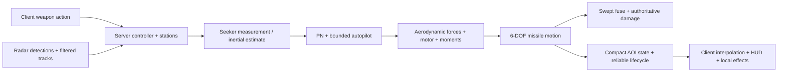

# M4 radar and air-to-air missiles — validation

Validated on 2026-10-06 against the current game baseline **2f6d45c**. The terrain,
procedural trees, atmosphere, afterburner, solo guns, throttle response, military
HUD and Su-57 maneuver-mode changes remain present. Protocol **13** extends the
current v12 schema and preserves the v10/M3.7.1 AOI, MTU, delta and recovery design.
The deployment target remains **16 players**, at **120 Hz / 8.333 ms**.

## Architecture

`ofs::weapons` contains reusable definitions, stations/inventory, radar/tracks,
sensor measurements, propulsion, aerodynamics, PN, actuator/autopilot logic and
rigid-body integration. `ofs::net::MissileCombat` owns launched entities, swept
fuses and authoritative damage through the existing `Combat`/`Life` events.
`World` connects each fighter's radar and weapon controller to those systems.


The client requests sequenced actions and draws authoritative presentation state.
There is no aircraft-specific missile guidance in a renderer or FCS.

Definitions are compiled configuration data, with two categories: **Dev IR-90**
and **Dev AR-157**. They are development approximations inspired by public missile
classes, not exact operational weapons. All important constants and their
REFERENCE / DERIVED / ESTIMATE / CALIBRATED_APPROXIMATION classification are in
[MISSILE_PHYSICS_PROVENANCE.md](MISSILE_PHYSICS_PROVENANCE.md).

Typhoon and Su-57 each carry two IR-90 and two AR-157; A320 and SR-71 carry none.
Stations use meter-scale body FRD coordinates and compatibility masks. Launch
removes exactly one mounted weapon, reducing mass by 90 or 157 kg. Store point
masses enter the existing payload/CG path, with a distributed inertia correction
rather than treating four stations as one mass at their centroid. Asymmetric
release changes CG and the full inertia tensor; tests require positive definiteness.
The intrinsic inertia of each mounted missile is omitted relative to the aircraft.

## Missile physics and guidance

Missiles integrate position, velocity, quaternion attitude, body angular velocity,
propellant, mass, inertia and fin actuator state. Authority advances at 120 Hz,
with four 480 Hz substeps; render time never drives physics. Launch inherits
aircraft velocity, attitude and angular velocity plus a 4 m/s downward separation.
Thrust follows finite boost/boost-sustain curves. Propellant flow is proportional
to motor impulse and inertia follows a slender cylinder at the current mass.

The shared ISA/weather model supplies density, sound speed and wind. Dynamic
pressure is `q = rho |Vair|²/2`; axial drag is `q S Cd`. The drag model includes
base drag, a Gaussian transonic rise, supersonic wave drag and a normal-force
coefficient squared induced term. Body incidence and finite controls create
normal forces; they are projected normal to the airflow to prevent artificial
energy gain. High-incidence control effectiveness degrades. Available force,
density, speed and control authority determine achieved acceleration, bounded
by the development structural limit (35 g IR / 30 g AR).

Translation integrates `(thrust + aero)/mass + gravity`. Attitude integrates
`I^-1(moment - omega cross I omega)` and quaternion rotation from angular velocity.
Aerodynamic stability, control torque and angular damping act physically; damping
is integrated implicitly because the small axial inertia makes explicit damping
unstable during combined turns. No step assigns attitude toward the target.
Variable-mass internal CG shift, CFD, fin flutter and motor angular-momentum flow
are omitted. These are coherent engineering models, not flight-test certification.

Pure PN uses `LOSrate = r cross relativeVelocity / |r|²`,
`closing = max(0, -r dot relativeVelocity / |r|)` and
`command = N closing (LOSrate cross unitMissileVelocity)` with `N=3.5`.
A bounded initial heading-capture term (0.6/s, at most 8 g) and gravity compensation
feed the same acceleration-limited autopilot. Requested incidence, fin travel and
fin rate are bounded. Controls generate forces/moments before motion; turning
costs induced drag and missiles can miss.

IR acquisition requires dwell, engine/aspect/reheat signal, inverse-square range
attenuation, LOS, boresight FOV, gimbal and slew limits. Lost measurements coast
for 0.5 s then become invalid. Acquisition readiness before launch also uses
persistent dwell. AR missiles use the launch radar estimate and inertial
extrapolation, optionally refreshed by a recent launch-owner radar lock. Predicted
range activates the seeker; autonomous terminal measurements require fourth-power
range/RCS signal, LOS, FOV, gimbal and acquisition dwell. AR memory is 0.7 s.
Support stops with an old/dead owner generation; terminal homing is autonomous.
An old target generation cannot attach to a respawned aircraft.

The HUD's **Kinematic estimate** accounts approximately for launch speed,
density/altitude, motor impulse, target closure and coast time. It is advisory,
not exact Rmax/Rne or a no-escape promise. Launch enforces readiness, inventory,
minimum range and cooldown; being outside the upper estimate does not force a miss.
Telemetry exposes speed, Mach, altitude, kinetic energy, propellant, age, travel,
target range, commanded/achieved g, thrust and dynamic pressure server-side.

## Radar and track validation

A reusable antenna scans ±60 degrees azimuth and ±30 degrees elevation. A
12-degree azimuth beam scans every 2 s, with 0.1 s detection visits; a lock revisits
its target. Detection is a deterministic normalized radar equation:
`SNR = aspectRCS (55 km / range)^4`, threshold 1, with a 90 km query bound,
terrain screening and Earth-horizon approximation. Front/side/rear RCS and IR
signatures are broad engineering estimates, especially for Su-57; no classified
performance is implied. Elevation coverage is a volume gate, not a detailed raster.

At most 16 tracks build confidence, filter measurements, extrapolate briefly and
expire after 3 s without detection. Locks break after 0.5 s without a measurement.
Selection, lock and missile-support modes are distinct. Death/disconnect/generation
changes retire tracks; respawn clears the controller and restores stores. Emission
and sensor-state interfaces exist for later defensive systems; no RWR is implemented.

Deterministic tests pass for inside/outside azimuth/elevation/range, SNR/RCS/aspect,
track formation, coast, expiry, selection/lock and generation retirement. Seeker
tests cover inside/outside FOV, beyond-gimbal loss, hot/rear versus frontal aspect,
afterburner signal, dead targets, lost/reacquired targets, unsupported midcourse
and transition to active terminal homing. Geometry singularities, 0–90 km altitude,
0–10 km/s speed and repeated fixed-step runs remain finite and repeatable.

At this scale radar uses a bounded fighter × aircraft loop. The measured query
cost is small; it does not introduce an unrestricted new spatial/ECS architecture.

## Physics measurements

Straight launches at 3 km, 250 m/s, no target/wind:

| Weapon | Burnout time / dry mass | Burnout speed | Speed at 12 / 17 s |
|---|---|---|---|
| IR-90 | 3 s / 66 kg | 683.89 m/s | 524.63 / 469.07 m/s |
| AR-157 | 9 s / 102 kg | 754.44 m/s | 663.39 / 555.86 m/s |

At 1 km versus 12 km, burnout speed is **677.05 / 705.05 m/s** IR and
**725.82 / 862.16 m/s** AR. Dense air produces more drag. A dedicated 5 g-limit
fixture verifies both commanded and achieved force bounds without requiring the
missile to attain an artificial fixed turn rate.

IR scenarios start at 6 km, 250 m/s, target initially 1.8 km ahead (except the
impossible target, 8 km lateral). Minimum center distance is a trajectory metric,
not the collision-sphere fuse threshold. Successful fixtures stop below 10 m;
misses run 25 s. These tests do not apply warhead damage.

| Scenario | Closest center distance | Peak achieved g | Burnout / intercept-or-final speed |
|---|---:|---:|---|
| Stationary | 6.152 m | 3.046 | 689.53 / 678.84 m/s |
| Crossing at 100 m/s | 5.169 m | 14.408 | 666.76 / 641.62 m/s |
| Receding at 1100 m/s | 1807.078 m, miss | 1.160 | 689.22 / 451.07 m/s |
| Sinusoidally maneuvering | 9.157 m | 13.873 | 674.58 / 654.43 m/s |
| Target turns after burnout | 100.923 m, miss | 16.009 | 689.53 / 445.11 m/s |
| Impossible off-boresight | 8000.693 m, miss | 0.153 | 692.53 / 458.58 m/s |

The burnout-turn fixture loses about 35% of speed; neither infinite thrust nor
kinematic target steering rescues the failed intercept. PN singular/analytic and
excessive-LOS-rate tests pass. Flight trajectories are development plausibility
and regression checks, not independently measured military missile performance.

## Fuses, damage and security

Time and travel arm the fuse. Moving missile and aircraft segments are swept
against the existing meter-scale collision sphere chains. Direct contact works
without a closing gate; proximity requires a closing sweep. The earliest armed
intersection controls detonation, clipped to the missile lifetime. Quadratic
warhead falloff uses distance to the hull; existing authoritative Hit/Destroyed
and Life/respawn logic apply damage once. Missile IDs occupy a range distinct from
gun rounds. In-flight missiles survive owner death, but disconnect retires them.
Pools, action queues, tracks, events, receiver histories and tombstones are bounded.

Live spoofing tests send foreign ownership, invalid station, future generation,
sequence/tick jumps, forged radar/missile state and malformed packets. The attacker
is disconnected, the other client remains connected and no missile spawns.
Station coordinates, launch velocity, target-hit and damage fields do not exist
in a client's action message. Empty stores, dead aircraft, duplicate actions and
invalid entities cannot create extra launches. Lifecycle tests reject stale spawns,
deduplicate detonation, recover watchdog-expired presentation, enforce target/owner
AOI priority and hide target identity from unrelated viewers.

Guns retain their independent held trigger/cooldown/ammo path. Existing gun tests
and the deterministic mixed gun/missile fixture exercise coexistence, kills and
respawn; choosing 1 restores held gun fire, while missiles fire on a press edge.

## Networking and bandwidth

All new messages use explicit big-endian integer encoding and the existing
24-byte header. Launch/lifecycle is ordered reliable; missile state is independently
applicable at 20 Hz; private radar is 10 Hz. No particles, full missile physics at
120 Hz, or world list for client radar is transmitted. Launch-owner radar support
is server internal, so support bandwidth is zero. Missile interest always includes
owner/target and observers within 15 km. Each pool has at most 128 missiles, eight
16-record state packets per publication. Four presentation samples interpolate
position and attitude, extrapolating at most 50 ms; a 2 s watchdog bounds stale state.
Aircraft recovery/history/assembly limits remain the M3.7.1 limits.

| Message / record | Maximum application bytes |
|---|---:|
| Weapon action | 38 |
| Missile record | 63 |
| Missile spawn or state, 16 records | 1033 |
| Missile retirement, 16 records | 361 |
| Radar, 16 tracks and 8 stations | 592 |
| Radar with current four-station fighters | 588 |
| Owner full aircraft projection | 611 (was 563) |
| Remote loading group | 36 (was 12) |
| Observed existing aircraft packet / overall ceiling | 1100 / 1100 |

Packet tests enforce exact boundary, over-boundary splitting, maximum chunk counts,
quantization, all truncations, invalid fields and 10,000 mutated missile packets.
The explicit codec rejects overcount and nonfinite quantization rather than wrapping.

Matched aircraft-only replication benchmarks archive/build baseline 2f6d45c and
run the same existing benchmark on the M4 schema. These isolate the distributed
loading schema overhead; they do not include the separate radar/missile stream.

| Matched case | Before / after outbound application B/s | Increase |
|---|---:|---:|
| 8 aircraft, normal, 20 simulated s | 175530 / 187226 | 6.66% |
| 16 clustered aircraft, normal, 10 simulated s | 596586 / 622682 | 4.37% |

Production World + aircraft/weapon codecs under a separate mixed-fleet duel fixture:

| 16-player case, 30 simulated s | Aircraft B/s | Radar B/s | Missile B/s | Total B/s | Peak missiles |
|---|---:|---:|---:|---:|---:|
| No missile use | 291616.6 | 11685.3 | 0 | 303302.0 | 0 |
| Moderate missile use | 276832.6 | 13043.2 | 205951.5 | 495827.4 | 53 |
| Heavy missile use | 261701.7 | 12891.7 | 677741.3 | 952334.7 | 128 |

Moderate missile bytes comprise spawn **2848.9 B/s**, state **202300.7 B/s**,
retirement **802.0 B/s**. Heavy use is spawn **6139.1**, state **669657.7**,
retirement **1944.5 B/s**. Retirement includes AOI exit, expiry and detonation.
Totals are aggregate application payload offered across all clients; they exclude
GNS UDP overhead and retransmissions. Aircraft byte counts change with motion,
AOI and death/respawn, so these scenarios are not a same-state schema comparison.

## 16-player impairments and soak

There are two independent validation layers. The deterministic harness runs real
World physics/weapon/aircraft replication with seeded loss, delay, jitter,
reordering, replayed actions and ordered reliable delivery. Live tests run real
GameNetworkingSockets, authoritative Server and 16 Client instances on loopback.
Both fleets include Typhoon/Su-57 plus one A320 and one SR-71. Fixtures arrange
duels initially and after respawn; they do not force hits or teleport missiles.

| Deterministic 30 s | Launches / detonations / missile hits | Kills / respawns | Usable aircraft frames | Queue peak / baselines |
|---|---|---|---|---|
| Normal | 122 / 69 / 69 | 37 / 35 | 11520 / 11520 | 326 / 64 |
| 2% loss, one-way 33–67 ms | 111 / 75 / 75 | 40 / 36 | 11141 / 11520 | 326 / 64 |
| 5% loss, one-way 83–133 ms | 98 / 69 / 69 | 38 / 37 | 10278 / 11520 | 453 / 64 |

Lost independent aircraft frames are not guaranteed recovery of every historical
frame; subsequent useful state continues. Baseline misses occur under loss and
recover without exceeding the existing 64 history / 4 assembly bounds. Normal
missile use retains every aircraft frame. Final drain leaves zero queued packets,
missiles or players and receiver watchdogs clear every missile.

| Live GNS, 30 wall-clock s | Launches / hits | Kills / respawns | Total app B/s | Server step p99 |
|---|---|---|---:|---:|
| Local | 168 / 103 | 49 / 41 | 923110.0 | 2.789 ms |
| 2% loss, 50 ms lag, 15 ms jitter, 1% reorder | 124 / 76 | 37 / 32 | 977628.1 | 2.059 ms |
| 5% loss, 100 ms lag, 30 ms jitter, 2% reorder | 100 / 61 | 27 / 27 | 1059211.7 | 1.793 ms |

GNS conditions are the transport preset's bidirectional impairment settings;
these are simulated WAN conditions on loopback, not a geographically distributed
WAN deployment. All live clients remain connected; observed new messages peak at
1033 bytes, with zero send failures. Worst listed app output is about 8.47 Mb/s
aggregate / 0.53 Mb/s average client, before transport overhead/retransmission.
The 16-player deployment needs suitable uplink headroom, not a packet-size increase.

The **180 simulated-second**, seeded 5% loss soak records 214 launches, 172
missile hits/detonations, 92 kills and 95 respawns. It receives 228987 missile
records and drops 10045 unreliable packets; queue peak is 453, baseline peak 64,
application packet peak 1100. Cleanup leaves zero entities and queued deliveries.

The separate **180 wall-clock-second live GNS** bad-network soak records 121
launches, 91 missile hits/detonations, 42 kills and 46 respawns. RSS is 49884 KiB
after warmup and peaks at 49900 KiB (+16 KiB); transport pending bytes peak at
7343. It has zero send failures, no dropped combat events and complete disconnect
cleanup. Three invalid messages are rejected without disconnecting valid
clients; they are not counted as valid launches. Server step p99 is 1.701 ms.
Subsequent full-suite reruns may have different live counts/timing; seeded physics
results are repeatable, while transport scheduling and CPU timing are not.

## Performance

Linux x86-64, Intel Core Ultra 7 255H, GCC 16, Release. World timings include
radar, aircraft, gun/missile physics and swept fuses; owner weapon encoding is
measured separately. Actual live Server step above includes server publication.
The synthetic active-pool sweep uses AR midcourse missiles; terminal seeker and
PN kernels are measured independently. The full 2/8/16 × 0/16/32/64/128 sweep
and raw values remain in the local performance transcript.

| Players | Missiles | World tick p99 (ms) | Missile physics p99 (us) | Radar p99 (us) | Owner weapon encoding p99 (us) |
|---|---:|---:|---:|---:|---:|
| 2 | 0 | 0.041 | 0.02 | 0.26 | 1.00 |
| 2 | 16 | 0.066 | 20.91 | 0.18 | 4.42 |
| 2 | 32 | 0.087 | 40.77 | 0.16 | 3.71 |
| 2 | 64 | 0.150 | 90.05 | 0.18 | 10.29 |
| 2 | 128 | 0.202 | 120.15 | 0.13 | 11.94 |
| 8 | 0 | 0.121 | 0.02 | 0.76 | 0.37 |
| 8 | 16 | 0.187 | 17.50 | 0.92 | 3.37 |
| 8 | 32 | 0.258 | 35.97 | 0.80 | 4.98 |
| 8 | 64 | 0.398 | 71.44 | 1.17 | 9.07 |
| 8 | 128 | 0.654 | 130.98 | 1.02 | 13.42 |
| 16 | 0 | 0.214 | 0.02 | 4.95 | 0.29 |
| 16 | 16 | 0.329 | 16.23 | 4.17 | 2.02 |
| 16 | 32 | 0.447 | 32.27 | 3.95 | 4.39 |
| 16 | 64 | 0.699 | 66.70 | 4.35 | 6.93 |
| 16 | 128 | 1.175 | 124.19 | 4.33 | 11.64 |

Seeker kernel mean: **0.0871 us**; PN mean: **0.0318 us**. The final isolated
16-player/128-missile World p99 is **1.175 ms**, leaving about **7.16 ms** of
the 8.333 ms tick budget before server publication overhead. The live server
measurements separately verify publication/transport work within that budget.


The 30 s gameplay fixtures also validate 2 and 8 players: respectively 18/10 and
53/32 launches/hits, 5/5 and 17/15 kills/respawns, with full cleanup. Timing values
are local measurements, not promises for all machines. Radar currently performs
bounded simple queries; costs should be remeasured as player/terrain scale grows.

## Native presentation and controls

L locks the selected target and selects missiles; Space launches one missile.
T/Y cycle targets, 1 selects guns, and 2/3 select IR/active radar.
Held Space/LMB/right trigger fires guns while guns are selected.
The existing flight/maneuver controls remain available. The HUD displays contact,
selected square, lock circle, target range/closure, inventory, readiness, kinematic
range estimate and launched missile speed/age. The radar panel sits below the
existing flight-operations UI. Meter-scale line/fins placeholders show mounted
stores and flying missiles; powered states generate local ignition plume/smoke,
with local detonation effects from reliable authority. Effects use bounded pools.

A native SDL/bgfx Su-57 client and authoritative tail-chase fixture pass: four
launches, two server hits/detonations and two rendered detonations. Capture is
visually inspected for scope, lock, inventory/readiness and missile presentation.
The script uses a local low-cost graphics configuration and X11 on this Linux
host; graphical quality/performance on Windows remains unverified. Slow startup
asset uploads exposed a real handshake problem, fixed by connecting after loading.
No runtime assets or generated screenshots are committed.

## Tests and sanitizers

Final Linux Release suite: **207 passed, 0 failed, 0 skipped** (207 total),
including **31 M4 cases**: 16 focused unit/physics/security/presentation suites,
9 deterministic multiplayer/soak/performance fixtures, 5 real GNS tests (including
spoofing) and 1 native graphical duel. Existing flight, asset, gun, networking,
M3.68/M3.7/M3.7.1 recovery and Su-57 maneuver regressions remain enabled. Runtime
models are present locally, so asset suites run rather than skip. The final JUnit
records these exact counts (766.18 seconds elapsed). Final review restricted
missile-support emission mode to non-autonomous AR missiles; IR launches retain
ordinary radar track mode. All 31 M4 cases were rechecked after that correction,
including both 180-second
fixtures. The native check initially collided with relinking its executable
(PermissionError); its subsequent isolated rerun passed. The final result is
31 passing M4 cases with no unresolved failures/skips. Live normal/2%/5% tests
also assert that explicit disconnect clears client missile and radar presentation.

ASan + UBSan + LeakSanitizer: **21 passed, 0 failed, 0 skipped**. That run covers
16 focused suites, seeded normal/2%/5%/180-second combat, and live spoofing,
with no sanitizer or leak diagnostics. The final radar-support correction also
passes a focused sanitized radar/security/multiplayer rerun (3/3); an additional
instrumented normal fixture validates the per-message bandwidth counters.
Optional 16-client real-time instrumented runs could not keep their server
clock at 120 Hz: Debug client tick 398 versus server tick 107, and optimized
RelWithDebInfo client tick 346 versus server tick 109, caused the normal future
input guards to reject/disconnect clients. Each attempt failed its live fixture;
no sanitizer error accompanied either. The optimized selection otherwise passed
its 21 focused tests (22 attempted: 21 passed, 1 failed, 0 skipped).
The final sanitizer-only live fixture advances server and client virtual clocks
together at one quarter real-time, retaining the production input guards and
120 Hz simulation step. Its isolated rerun **passed: 1 passed, 0 failed, 0 skipped**,
30 simulated seconds / 120 wall seconds, 196 launches, 112 hits, 56 kills,
42 respawns, zero invalid inputs/send failures, empty disconnect cleanup, and no
ASan/UBSan/leak diagnostics. Instrumented tick p99 was 10.111 ms: this is a memory
and transport check, not a 120 Hz wall-clock performance pass. Release retains
normal clocks; its final isolated live rerun passed in 30.08 wall seconds with
192 launches, 112 hits, zero invalid inputs/send failures and tick p99 1.896 ms.
Performance claims above always refer to Release.
Third-party transport workers are not
claimed to have TSan coverage. A separate network-disabled native-client syntax
check verifies offline compilation guards.

Initial regressions found an old exact-size fixture, stale provenance hashes and
a network soak continuity assertion spanning a respawn teleport. The packet
fixture now retains its exact 1100-byte boundary for v13; manifests refresh only
source revisions; continuity still checks each life and the interpolator resets
between generations. The native window-transition smoke passes using SDL X11;
the default backend's earlier window-manager timeout is not treated as a pass.

TSan is **unavailable**: a fresh `c++ -fsanitize=thread` probe fails to link because
`/usr/lib64/libtsan.so.2.0.0` is absent. **Zero TSan tests ran; no TSan pass claimed.**
The repository's Windows Preparation workflow was triggered by the M4 push
(`13a2b7869a3073ce9652c29c243fa820a181e0aa`).
[Run 37444439025](https://github.com/KindaBad/OpenFlightSim/actions/runs/37444439025)
failed before starting its MSVC job: GitHub's annotation reports failed recent
account payments or a spending limit requiring an increase. The job has zero
steps/logs; **zero Windows builds/tests ran**. This external billing blocker is
separate from local validation. No Windows native graphical runtime is available
on this Linux host, so that remains
**unverified**. A pending or failed CI run is not a Windows build/test pass.
The codec is endian-explicit and introduces no Linux-only runtime requirement;
optional `/proc` RSS collection returns zero on other platforms.

## Reproduction and local evidence

Use the project's normal dependency setup, then:

```sh
cmake --build build/release -j 3
ctest --test-dir build/release --output-on-failure -j 3
build/release/tests/ofs_missile_tests guidance
build/release/tests/ofs_m4_validation performance
build/release/tests/ofs_m4_validation normal
build/release/tests/ofs_m4_validation moderate
build/release/tests/ofs_m4_validation poor
build/release/tests/ofs_m4_validation soak
build/release/tests/ofs_m4_live local
build/release/tests/ofs_m4_live moderate
build/release/tests/ofs_m4_live bad
build/release/tests/ofs_m4_live soak
build/release/tests/ofs_m4_live abuse
python3 scripts/validate_graphical_missiles.py build/release
```

On this host, set `SDL_VIDEODRIVER=x11` for native window smoke. The local extracted
protobuf sysroot needs its lib64 path during build; the extracted sanitizer runtime
needs its path when running sanitized tests. These are environment accommodations,
not new source dependencies. ASan uses `detect_leaks=1:halt_on_error=1`, UBSan
`halt_on_error=1`. Generated `output/m4/` evidence is ignored: raw per-scenario
logs, matched baseline sources/build, full-suite JUnit, sanitizer JUnit, TSan
probe output and native PPM/PNG captures are retained locally.

## Remaining limitations and M4.5 readiness

These are public-class development approximations, with simplified aero, RCS,
IR background/signatures, radar, antenna geometry, coasting measurements,
envelope and hull-distance warhead falloff. There is no detailed fragmentation,
advanced datalink network, component-directed missile damage or lag compensation.
Only the nominated seeker target is considered; scene-wide IR clutter/target
competition and countermeasure discrimination are future work. Actively scanning
multi-target radar uses a simple bounded loop rather than broad spatial queries.
Hardpoints and Su-57 bay positions are explicitly engineering estimates.

There is no RWR, MAWS, flare/chaff, ECM/jamming, expanded kill feed or avionics page.
Solo missile combat is not implemented. Windows native runtime and real WAN
play remain unverified. **64-player WAN combat remains unvalidated**; preserved
64-entity replication tests are scaling regressions, not M4 deployment approval.

M4.5 defensive systems may build on the tested emission/mode, seeker measurement,
authority, generation and lifecycle interfaces. They need their own signature,
warning, countermeasure, security and network validation; these physics estimates
must not be presented as exact real-world military equipment.
